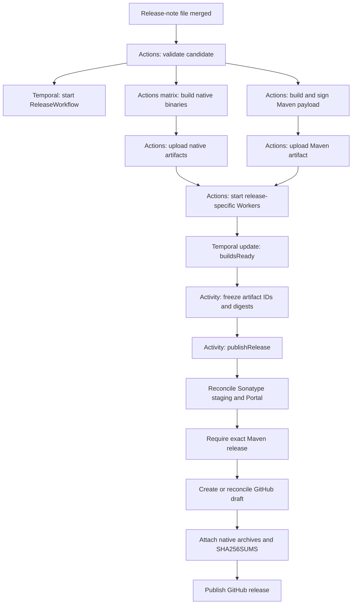

# Temporal release automation

The release is authorized by merging one new `releases/vX.Y.Z` file into a branch watched by `temporal-release-candidate.yml`: `main` or a branch matching `release-*`

## Components

- `temporal-release-candidate.yml`: merge trigger, native build matrix, signed Maven build, Actions artifact storage, and short-lived Workers.
- `build.py`: Called by `temporal-release-candidate.yml`. Creates reproducible native archives and the signed, manifested Maven payload.
- `release.py` contains the Workflow, Activities, external-state reconciliation, and the `start` and `publish` command entry points.
